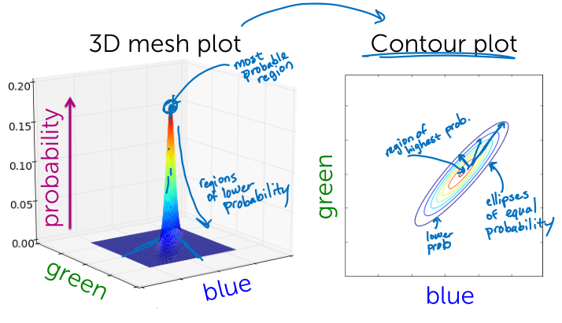
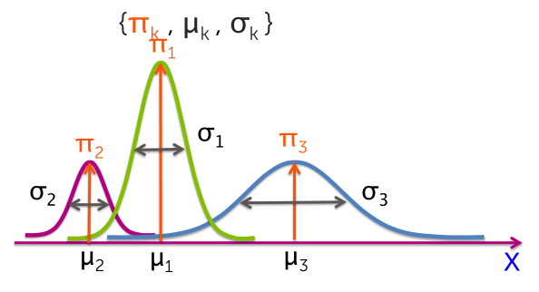

## Motiving probabilistic clustering models
K-means don't really tell the full story. Instead what we like to do is somehow be able to capture the uncertainty to extract extra information from the data set.

**Failure modes of k-means**
- Disparate cluster sizes, i.e. clusters have different spreads
- Overlapping clusters (uncertainty)
- Different shapes / oriented clusters
- Spherically symmetric clusters
    - All cluster have same axis-aligned ellipses if weight is specified.

**Mixture model**
*Probabilistic model*
- Provides **soft assignments** of observations to clusters (uncertainty)
- Accounts for cluster shapes not just centers
- Enables learning weightings of dimensions
    - Can learn cluster-specific weights on dimensions

### 2D Gaussians

Fully specified by $N(x \vert \mu, \Sigma)$
- The mean $\mu: specifies the centers of the distribution.
- The covariance $\Sigma$: specifies the spread and orientation/correlation of the distribution in the diagonals.

**Combinations of weighted Gaussians**
Associate a weight $\pi_k$ with each Gaussian component:
$$
0 \leq \pi_k \leq 1 \\
\sum^K_{k=1} \pi_k = 1
$$

> Convex combination

Without observing the image content, what's the probability it's from cluster $k$? (e.g., prob. of seeing *clouds* image)
$$
p(z_i = k) = \pi_k
$$

> The prior term.

Given observation $x_i$ is from cluster $k$, what's the likelihood of seeing $x_i$? (e.g., just look at distribution for *clouds*)
$$
p(xi \vert z_i = k, \mu_k, \Sigma_k) = N(x_i \vert \mu_k, \Sigma_k)
$$

The probability of an observed RGB vector ($x_i$) given that it's in cluster $k$, is just a single Gaussian with mean $\mu$ and covariance $\Sigma$.

> The likelihood term

### Expectation Maximization (EM)
*Output a set of soft assignments per data point.*  

If we know the cluster parameters, all we have to do is for each one of our possible clusters, we compute the prior times the likelihood. To form our responsibility and then just normalize the vector, so that it sums to one over all the possible clusters.

Desired soft assignments (*Responsibilities*) are easy to compute when clsuter parameters ($\pi_k, \mu_k, \Sigma_k$) are known, but we don't know these.

> Only the observations that are assigned to a given cluster inform the parameters of that cluster.

#### Cluster parameters estimates
*weights on each row operation*  

Total weight in cluster $k$, equals effective number of observations:
$$
N_k^{\text{soft}} = \sum^N_{i=1} r_{ik}
$$

If $r_{ik}$ only $\in \{0, 1\}$ (hard assignments) like *One-hot encoding* of cluster assignments. Then the sum is just going to count observation $i$ in cluster $k$.

**Mean**
Average data points in cluster $k$
$$
\hat{\mu}_k = \frac{1}{N_k^{\text{soft}}} \sum_{i = k} r_{ik} \ x_i
$$

**Covariance**
$$
\hat{\Sigma}_k = \frac{1}{N_k^{\text{soft}}} \sum_{i = k} r_{ik} \ (x_i - \hat{\mu}_k) (x_i - \hat{\mu}_k)^T
$$

**Cluster proportion**
Proportion between the number of observations in cluster $k$ and the total observations:
$$
\hat{\pi}_k = \frac{N_k^{\text{soft}}}{N}
$$

## Expectation Maximization algorithm
*Iterative algorithm*
1. **E-step:** estimate cluster Responsibilities given current parameters estimates
$$
\hat{r}_{ik} = \frac{\hat{\pi}_k N (x_i \vert \hat{\mu}_k, \hat{\Sigma}_k)}{\sum^K_{j=1} \hat{\pi}_j N (x_i \vert \hat{\mu}_j, \hat{\Sigma}_j)}
$$

1. **M-step:**  maximize likelihood over parameters given current responsibilities:
$$
\hat{\pi}_k, \hat{\mu}_k, \hat{\Sigma}_k \vert \{ \hat{r}_{ik}, x_i \}
$$

Estimates the shapes of these different clusters and their locations in the space, not just the cluster locations.  

  

- Pie charts in a data point represent the responsibilities associated with that observation.
- Ellipses represents the three different 2D Gaussians.

Even after convergence, there's still uncertainty that's represented in that observations cluster assignment. In contrast to k mean, that would have made a hard decision.

**Convergence of EM**
- EM is a coordinate-ascent algorithm
    - Can equate E and M steps with alternating maximizations of an objective function
- Convergence to a local mode

Maximizing likelihood can **overfit to data** $\rightarrow$ Set center equal to point and shrink variance to 0.

## Code
*The mean defines the center of the cluster, and the covariance defines the spread.*

- Summing over a row always yields 1, as all fractions of a point must add up to a whole.
- Summing over a column yields what is known as the “soft count” of the cluster.
- The soft counts for all clusters sums to the number of data points.

**E-step:**
*Compute cluster responsibilities, given cluster parameters.*
- Compute the value of the PDF of the Gaussian distribution at each data point. Use the mean vector and covariance matrix as parameters of the Gaussian distribution.
- Multiply the PDF value by the cluster weight. This is the likelihood measure.
- Normalize all likelihood measures.

Cluster responsibilities for a single data point $i$ should sum to 1:  
$$
r_{i1} + r_{i2} + \ldots + r_{iK} = 1
$$

To figure how much a cluster is responsible for a given data point, we compute the likelihood of the data point under the particular cluster assignment, multiplied by the weight of the cluster. For data point $i$ and cluster $k$:  
$$
r_{ik} \propto \pi_k N(x_i | \mu_k, \Sigma_k)
$$

To ensure that all responsibilities over each data point add up to 1, we add the normalization constant in the denominator:  
$$
r_{ik} = \frac{\pi_k N(x_i | \mu_k, \Sigma_k)}{\sum_{k=1}^{K} \pi_k N(x_i | \mu_k, \Sigma_k)}
$$

**M-step:**
*Compute cluster parameters, given cluster responsibilities.*
- Cluster weights: The relative importance of a cluster is determined by its soft count.
    - Since the cluster weights must add up to 1, we add all soft counts and normalize them by their sum.
- Means: We first add fractional parts of all data points, using the cluster responsibilities.
    - Then we divide this sum by the soft count.
- Covariances: The covariance is computed using fractional parts as well, except now we are summing matrices known as *outer products.*

> Each time the means and covariances are revised, the clusters change shape to better reflect patterns in the data.

**Computing soft counts**
Before updating the parameters, we first compute what is known as "soft counts". The soft count of a cluster is the sum of all cluster responsibilities for that cluster:
$$
N^{\text{soft}}_k = r_{1k} + r_{2k} + \ldots + r_{Nk} = \sum_{i=1}^{N} r_{ik}
$$

> Unlike k-means, we must loop over every single data point in the dataset. This is because all clusters are represented in all data points, to a varying degree.

**Updating weights**
The cluster weights show us how much each cluster is represented over all data points. The weight of cluster $k$ is given by the ratio of the soft count $N^{\text{soft}}_{k}$ to the total number of data points $N$:
$$
\hat{\pi}_k = \frac{N^{\text{soft}}_{k}}{N}
$$

$N$ is equal to the sum over the soft counts $N^{\text{soft}}_{k}$ of all clusters.

**Updating means**
The mean of each cluster is set to the weighted average:
$$
\hat{\mu}_k = \frac{1}{N_k^{\text{soft}}} \sum_{i=1}^N r_{ik}x_i
$$

**Updating covariances**
The covariance of each cluster is set to the weighted average of all outer products, weighted by the cluster responsibilities:
$$
\hat{\Sigma}_k = \frac{1}{N^{\text{soft}}_k}\sum_{i=1}^N r_{ik} (x_i - \hat{\mu}_k)(x_i - \hat{\mu}_k)^T
$$

The *outer product* in this context refers to the matrix product:
$$
(x_i - \hat{\mu}_k)(x_i - \hat{\mu}_k)^T
$$

Letting $(x_i - \hat{\mu}_k)$ to be $d \times 1$ column vector, this product is a $d \times d$ matrix. Taking the weighted average of all outer products gives us the covariance matrix, which is also $d \times d$.
