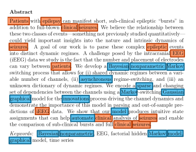
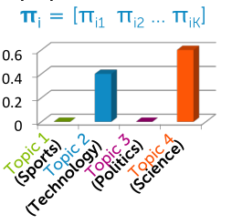

##  Latent Dirichlet Allocation (LDA topic models)
**Mixed Membership Models:**  
Allow us to associate any given data point with a set of different cluster assignments.

> In soft assignments captures uncertainty in the cluster assignment, but the clustering model still assumes that each document is assigned to a single topic.

*Multiset:* Unordered set of words with duplication of unique elements mattering.

*Prior probability:* probability that a given document is associated with a specific cluster, $p(z_i = k) = \pi_k$

**Topic-specific word probabilities:**
For every topic, we're going to have a probability vector over words in the vocabulary.  

> Distribution on words in vocab for each topic.

**Comparing and contrasting**
- **before**, compute likelihood of tf-idf vector under each Gaussian
- **now**, compute likelihood of the collection of words in doc under each topic distribution

> Now, each document is represented with a bag-of-words. Look at the probability of each of these words under the topic specific probability vector over words.

### Components of latent Dirichlet allocation model
*Want to discover a set of topics.*  

Our goal is to associate with the document a collection of topics present in that document as well as their relative proportions in the document.

Instead of assigning the entire document, every word is going to have an assignment variable $z_{iw}$.  

  

> One topic indicator $z_{iw}$. per word in doc $i$

Then when we go to score a document, we're going to score all of the words under each of these assigned topics.  

> Each words gets scored under its topic $z_{iw}$.  

Instead of introducing a corpus wide distribution on this topic prevalences, each document is going to have a distribution over the prevalence of topics in that document the represent our desired topic prevalence in this specific document.  

  

> Distribution on prevalence of topics in document $\pi_i = [\pi_1, ..., \pi_K]$  

**LDA inference**
- Set of topic specific vocabulary distributions that are shared throughout the entire corpus
- For every document and every word and every document there's an assignment variable of that word to a specific topic
- For every document, there's the topic proportions in that document $\pi_i$

**LDA inputs:**  
- Set of words per doc for each doc in corpus

**LDA outputs:**  
- Corpus-wide topic vocab distributions
- Topic assignments per word
- Topic proportions per doc

> Examine coherence of learned topics. Or, doc-specific topic proportions.

### Bayesian inference
**Multinomial likelihood** of word counts ($m_w$ successes of word w), resulting in a mixture of multinomial model.

**Typical LDS implementations**
Normally *LDA* is specified as *Bayesian model* / *probabilistic latent semantic analysis, indexing.*

- Account for uncertainty in parameters when making predictions.
    - Forming a prediction for each one of these values, and computing a weighted average of those predictions.
- Naturally regularizes parameter estimates in contrast to MLE

> The EM Algorithm is no longer tractable. Because the E step in particular has this intractable expectation. So instead what you can do is something that's called variational; where you introduce an approximation to handle that really complicated expectation.

#### Gibbs sampling
*Iterative random hard assignments.*

- Hard assignments are going to be drawn randomly from a specific distribution.
- Typically intuitive updates and straightforward to implement.  

There's no guarantee that we're going to increase our joint probability. This is not an optimization algorithm. We're actually intending to explore this space of possible solutions, rather than converge just to a single point.

> Eventually, after enough iterations, the random samples that are produced by our Gibbs sampling algorithm allow us to form what are called correct *Bayesian estimates*.

**What to do with sampling output?**  
**Predictions:**
1. Make prediction for each snapshow of randomly assigned variables/parameters (full iteration)

1. **Average predictions** for final result
- Because of how the Gibbs sampler is exploring uncertainty, it's spending more time in high probability regions and less time in low probability regions. It's forming a correct prediction.

**Parameter or assignment estimate:**
- Look at snapshot of randomly assigned variables/parameters that maximizes *joint model probability*
- Maximum a posteriori parameter estimate.

 ### Gibbs sampling algorithm
*Iterative random hard assignment.*

Assignment variables and model parameters treated similarly.

Iteratively draw variable/parameter from conditional distribution having fixed
- All other variables/parameters
    - values randomly selected in previous rounds
    - changes from iter to iter
- Observations
    - always the same values

**Steps:**
1. Randomly reassign all $z_{iw}$ based on
    - doc topic proportions
    - topic vocab distributions
    > Draw randomly from responsibility vector [$r_{iw1}, ..., $r_{iwK}]

1. Randomly reassign doc topic proportions based on assignments $z_{iw}$ in current doc

1. Repeat for all docs

1. Randomly reassign topic vocab distributions based on assignments $z_{iw}$ in entire corpus

1. Repeat until max iter reached

**Collapsed Gibbs sampling in LDA**
Based on special structure of LDA model, can sample **just** indicator variables $z_{iw}$
- No nee to sample other parameters
    - corpus-wide topic vocab distributions
    - per-doc topic proportions

So, randomly reassign $z_{iw}$ based on current assignment $z_{jv}$ of all other words in document and corpus.

> Often leads to much better performance because examining uncertainty in smaller space.

We never have to sample our topic vocabulary distributions or the document specific topic proportions. We just sample these word indicator variables. But we do so sequentially losing the ability to paralyze across that operation.

> Never draw topic vocab distributions or doc topic proportions.

**Output of collapsed Gibbs sampling**
*Samples of just the word indicators.*

## Code
*Mixed membership:* Each document can partially belong to several different topics.

LDA requires documents to be represented as a *bag of words*, which ignores word ordering in the document but retains information on how many times each word appears.

Then we will remove the common words that don't help us to distinguish between document.

> The method used to fit the LDA model is a randomized algorithm.

- On LDA we learned that a topic is a probability distribution over words in the vocabulary; that is, each topic assigns a particular probability to every one of the unique words that appears in our data.
    - Different topics will assign different probabilities to the same word.
    - Looking at the highest probability words in each topic will thus give us a sense of its major them
    - Our LDA representation, on the other hand, defines similarity between documents in terms of their topic distributions. This means that documents can be "close" if they share similar themes, even though they may not share many of the same keywords

- With TF-IDF, documents are distinguished by the frequency of uncommon words. Since similarity is defined based on the specific words used in the document, documents that are "close" under TF-IDF tend to be similar in terms of specific details

**LDA model hyperparameters**
Smoothing parameters: that serve to reduce the differences across topics or words in terms of these calculated preferences.

-  Alpha is a parameter of the prior distribution over topic weights in each document.
    - how much each document "likes" a topic
    - makes the document preferences "smoother" over topics
    - the impact of changing its value should be visible when we plot the distribution of topic weights for the same document under models fit with different alpha values.
    - when alpha is low most of the weight in the topic distribution for this article goes to a single topic, but when alpha is high the weight is much more evenly distributed across the topics.
- Gamma is a parameter of the prior distribution over word weights in each topic.
    - how much each topic "likes" a word
    - makes the topic preferences "smoother" over words
    - Visualize the impact of changing gamma by plotting word weights for each topic
    - low gamma model results in higher weight placed on the top words and lower weight placed on the bottom words for each topic, while the high gamma model places relatively less weight on the top words and more weight on the bottom words.
    - increasing gamma results in topics that have a smoother distribution of weight across all the words in the vocabulary.
