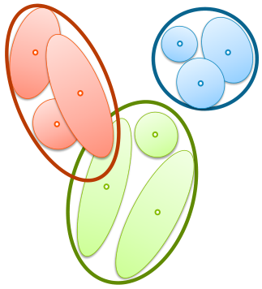
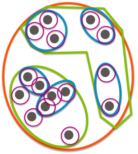
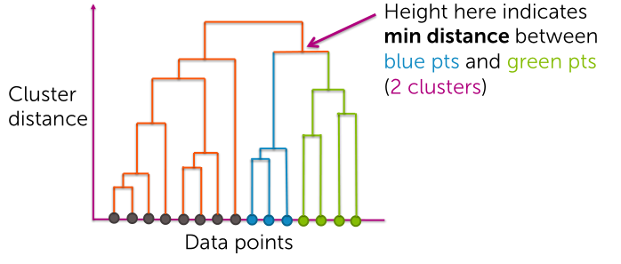
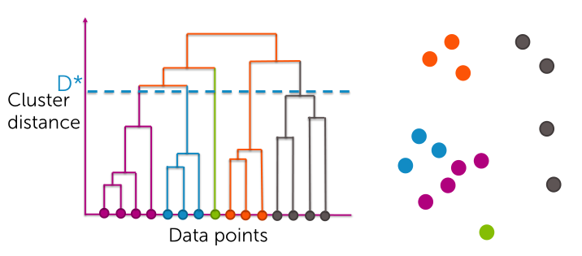

## Recap
### Module 1
Retrieval and cast that as a problem of performing nearest neighbor search.

- Nearest Neighbor (NN):  
Look at all of our data points, and look for the $k$ data points most similar to the query point.

- Performance
    - how we think about representing our data.
    - how are we going to measure the similarity, or the distance between two data points?

**TF-IDF**
Representation based on TF-IDF, term frequency-inverse document frequency.
- The term frequency is simply counting words in the document. So we look at our entire vocabulary and in each index of this vector, we simply count how many times we saw a given word. This can bias our nearest neighbor search towards emphasizing very common words.
$$
\text{tf} = \text{word counts}
$$
- And the inverse term, down-weights words that are very commonly used globally throughout the corpus.
$$
\text{idf} = log \bigg(\frac{\text{# docs}}{1 + \text{# docs using word}} \bigg)
$$

TF-IDF representation: $\text{tf} * \text{idf}$

> Tradeoff between local frequency and global rarity.

**Distance**
- Scaled Euclidean distance (weights)
$$
\text{distance}(x_i, x_q)=\sqrt{a_1(x_i[1] - x_q[1])^2 + ... + a_d(x_i[d] - x_q[d])^2}
$$
- Cosine similarity
    - Inner product of two normalized vectors, one for each of our documents.
    - Normalizes the vectors that we're looking at. So it ignores the scale of the individual vectors.

**Approximate nearest neighbor search**
- KD-trees
    - Recursively partition our feature space to create a binary tree, and where the data points are stored at the leaves of this tree.
    - KD-trees just really don't scale well to high-dimensional feature spaces.
- Locality sensitive hashing (LSH)
    - Random lines partition our feature space. And the collection of the lines define what we're going to think of as bin indices for each of these data points.
    - stored in hash tables, based on the binary representation of this bin index. Query point in adjacent bins.

### Module 2
*Discover groups of related articles.*
- K-means
    - Initialize by just placing a set of cluster centers, and then the algorithm iterates between making hard assignments of data points to the nearest cluster center, and then updating the cluster centers.
    - Not going to converge necessarily to the global mode, but the algorithm does converge just to a local mode.
    - Initialization matters really significantly for the quality of the solution found, as well as the convergence rates. But, just like in our first module on retrieval.

- MapReduce
    - Generic framework for parellelizing computations across multiple machines under certain specific setups.
    - map step that has to be data-parallel over elements, and a reduce step that performs some aggregation that has to be data-parallel over keys.

We can think about the classify step of making the hard assignments of data points to cluster centers as data parallel over elements. And the recenter step, where we recompute the centers of each of the clusters as data parallel over keys.

So we have a map and reduce step here, but in k-means we mention that we have to iterate between these steps again and again, which is a non-standard implementation of MapReduce.

### Module 3
Mixture models allow us to capture uncertainty in the assignment of data points to clusters.

Our mixture of Gaussian model was defined in terms of a collection of Gaussian components each defined with a specific mean and variance as well as a mixture of weight. So how heavily that class was going to represented in the mixture.

> In practice, one would often want to specify just a diagonal form to the Gaussian covariance matrix to dramatically reduce the number of parameters.

**Expectation maximization**
Allows us to jointly infer both the model parameters as well as these soft assignments that describe our uncertainty in the assignment of data points to specific clusters.

Initialization matters a lot. And typically people rerun the algorithm many times, and choose the best solution.

- E step, forms these soft assignments, based on our current estimate of the model parameters.

- M-step, computes the maximum likelihood estimate of our model perimeters given the soft assignments at the current iteration and then we reiterate again and again between these steps until convergence.

> Can be describes as a coordinate to send algorithms. So we get the same types of properties, where you get convergence to a local mode of the objective.

If we look at a mixture of Gaussians with spherically symmetric Gaussians, so diagonal co-variants with same elements along the diagonal and then we shrink that variance to 0 and we run our Algorithm, the output is exactly the same as k-means.

Because what we're going to end up doing are making hard assignments of data points to specific clusters just based on the distance to the cluster center. So indeed looking at For mixtures of Gaussians is really a generalization of the k-means algorithm.

### Module 4
We look at something called mixed membership modeling. And for a document analysis task, this model was called Latent Dirichlet allocation.

Probabilistic model that provide a more intricate description of our data point and the relationships between data points than our simple clustering representation.

model itself. Where here, every word in every document had an assignment variable linking that word to a specific topic

a specific topic. So then when we think about scoring a document in LDA. We think of scoring every word under its associated topic.

under its associated topic. Where these topics are defined exactly like in the alternative questioning we just described. Where there's a distribution over every word and a vocabulary specific to the topic.

thing is, we introduced this topic proportion vector specific to each document rather than it representing corpus wide topic proportions

mixed membership representation of every document. So a document doesn't belong to just one topic, it belongs to a collection of topics. And there are different weights on how much membership the document has in each one of these topics

out these topic vocabulary distributions and these document topic proportions. And critical to doing this, just like in Is inferring that assignments of the words to specific topics

described was called Gibbs sampling

reassigning each conditioned on the instantiated values of all the other parameters or variables. So at first, we could think about randomly reassigning the topics for every word in a document. And then we can think about fixing these and sampling the topic proportion vector for that specific document. And then repeating these steps for all documents in the corpus. And then having fixed these values we can think about resampling the topic vocabulary distributions.

Collapsed Gibbs sampling. Where we
analytically integrate out over all these model parameters the topic vocabulary distributions and these document specific topic proportions. And we just sequentially sample each indicator variable of a given word to a specific topic conditioned on all the other assignments made in that document and every other document in the corpus.

two terms. One is how much a given document likes this specific topic, and the other is how much that topic likes a specific word considered.

multiply those two terms together. And then we think about renormalizing this across all possible assignments that we could make. And then we use that distribution to sample a new topic indicator for that specific word.

corpus. Finally, in this module we talked about how we can use the output of Gibbs sampling to do Bayesian inference. Remember if we're thinking about doing predictions in the Bayesian framework, we want to integrate over our uncertainty in what value the model parameters can take.

about how we can take each one of our give samples form predictions from that sample and then average across those samples. Or alternatively and something that's very commonly done in practice is just look at the one sample that maximise, what we call joint model probability and then use that to draw inferences.

## Hierarchical Clustering
- Avoid choosing the number of clusters beforehand
- Dendograms helps visualize different clustering granularities without the nedd to re-run the algorithm
- Allows user to choose any distance metric
- Often can fiend more complex shapes than k-means or Gaussian mixture models

**Types of algorithms**
- Divisive (*top-down*):
    - Start with all data in one big cluster and recursively split
- Agglomerative (*bottom-up*):
    - Start with each data point as its own cluster. Merge clusters until all points are in one big cluster, e.g. *single linkage*

### Divisive clustering
Idea where we take each cluster at a given granularity, dig down and specify it as a set of clusters itself.  

  

> Recursive k-means

**choices**
- which algorithm to recurse
- How many clusters per split
- When to split vs stop
    - Max cluster size:  
    Number of points in cluster falls below threshold
    - Max cluster radius:  
    spread of the cluster; distance to furthest point falls below threshold
    - Specified number of clusters:  
    split until pre-specified number of clusters is reached

### Agglomerative clustering
Clusters defined at different granularities.

Single linkage:
1. Initialize each point to be its own cluster
1. Merge clusters based on the distance of every single pair of clusters
    - distance function
    - linkage criteria  

> For Single linkage, the distance is the minimum distance of any set of points in the two clusters.

**Computational considerations**
- Computing all pairs of distances is expensive
    - brute force algorithm is O($N^2$ log(N)), N: datapoints
- Smart implementations use triangle inequality to rule out candidate pairs, best O($N^2$)

**Statistical issues**
*Chaining:* distant points clustered together.

Consider other linkage functions
- Complete linkage:  
Max pairwise distance between clusters
- Ward criterion:
Min within-cluster variance at each merge

> Can be more robust, but restrict the shapes of clusters that can be found

### Dendrogram
hierarchical representation

- Along the x axis, we're going to place each one of our data points
- Along the y-axis (height), is the minimum distance between different clusters
- The path down indicates, what cluster that data point belonged to and the sequence of merges made for those clusters.

So in summary, we see that the dendrogram is able to capture all the critical elements of the hierarchical clustering result.
- what are the different cluster memberships?
- Which cluster is merged with which?
- What were the distances between those clusters at the point at which they merged?

**Extracting partitions**
Every branch that crosses D* becomes a separate cluster

What we're saying then is that, for the resulting clusters produced by this cut, there are no pair of clusters at a distance less than D* that have not already been merged.

> So this means that D* is the minimum distance between our clusters at this level of the clustering.

### Hidden Markov models (HMM)
We've looked at methods where the index of a given data point, plays no role in the resulting clustering. But what if the order of the data points actually mattered, like in time series.

> HMM is very similar to the type of mixture models.

Every observation has a cluster assignment/state associated with it and that's unknown to us, all we get is the observed value.

And then, also, just like in our mixture, every cluster or state has a distribution over observed values.

The critical difference is that the probability of a given cluster assignment, depends on the value of the cluster assignment for the previous observation.

>  And so it's through this structure of dependency in the cluster of assignment variables across time that we're able to extract this type of time dependent clustering.

**Inference in HMMs**
- Learn MLE of HMM parameters using EM algorithm, *Baum Welch*
- Infer MLE of state sequence given fixed model parameters using dynamic programming, *Viterbi algorithm*
- Infer soft assignments of state sequence using dynamic programming, *forward-backward algorithm*

### Other clustering retrieval topics
- Retrival
    - Other distance metric
    - Distance metric learning
- Clustering
    - Nonparametric clustering
    - Spectral clustering
- Related ideas
    - Density estimation
    - Anomaly detection

## Code
**Hierarchical Clustering**
Refers to a class of clustering methods that seek to build a hierarchy of clusters, in which some clusters contain others.

> we would like to achieve similar level of granularity for all clusters
